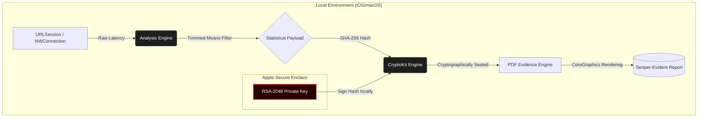

# NetProof

**NetProof** is a high-performance network auditing tool for iOS and macOS, built to provide transparency and cryptographically verifiable evidence of network quality.

### Motivation & Core Philosophy
In a landscape dominated by opaque network diagnostics, proving the root cause of connectivity issues is often challenging. NetProof was built to bridge this gap by providing **cryptographically verifiable evidence**. Every network test result is locally processed, hashed, and signed, creating an immutable proof of connection quality. This makes it an ideal tool for professional technical audits, service-level agreement (SLA) verification, or transparent dispute resolution with ISPs.

### Architecture
NetProof follows a strict **Offline-First** and decentralized architecture. All computational processes—from statistical analysis of network jitter to cryptographic signing and PDF report generation—are performed entirely on-device. This guarantees that sensitive diagnostic data never leaves the user's environment unless explicitly exported.

### Key Features
* **Verifiable Integrity:** Every diagnostic run produces a unique SHA-256 hash representing the exact state of the network at that time.
* **Hardware-Backed Security:** Cryptographic signatures are generated using RSA-2048 keys managed securely within the Apple Secure Enclave / Keychain.
* **Advanced Statistical Engine:** Employs trimmed means and sample standard deviation to filter out network anomalies and accurately measure true jitter.
* **Actionable Reporting:** Generates professional, localized PDF evidence files with embedded QR codes for instant integrity validation.

### Privacy & Compliance
NetProof is built from the ground up with strict privacy-by-design principles to ensure global compliance (including GDPR and LGPD):
* **Zero PII Collection:** The application does not collect, store, or transmit Personally Identifiable Information.
* **Masked Metadata:** Sensitive environment data (like SSID and BSSID) is masked to prevent tracking.
* **No Cloud Dependency:** Core diagnostic functionality operates completely independent of external APIs.

### Built With
* **Swift 5.10+:** Leveraging modern Swift concurrency (`async/await`, `@MainActor`, `Task`) for safe, non-blocking execution.
* **SwiftUI & Combine:** Declarative UI and reactive data flow for a fluid, responsive native experience.
* **Foundation (URLSession):** Resilient, low-overhead native diagnostic probes utilizing standard HTTP methods.
* **CryptoKit:** Apple's native framework for secure hashing and cryptographic operations.

### Getting Started
1. Clone the repository to your local machine.
2. Open `NetProof.xcodeproj` in Xcode 15+.
3. Select your target device (Simulator or physical iOS/macOS device).
4. Build and run to start performing local network audits.

### Verification Protocol
To verify the integrity of a generated evidence report:
1. Extract the raw data payload from the PDF or JSON export.
2. Use any standard SHA-256 tool to hash the raw test data.
3. Compare your generated hash with the one embedded in the evidence document. A match guarantees the report has not been tampered with since its creation on the device.

---
*Licensed under the MIT License.*
